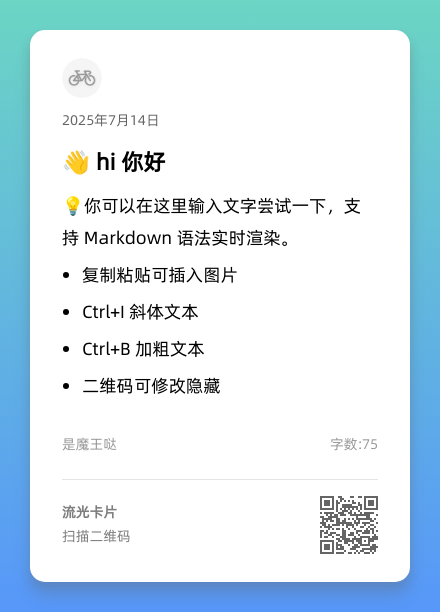

# 流光卡片 - 流媒体卡片生成服务

一个基于 Node.js + Puppeteer 的高性能流媒体卡片生成服务，支持多平台（Twitch、YouTube、Bilibili等）的个性化卡片生成。

## ✨ 功能特性

- 🎨 **多样化模板**: 支持多种卡片模板和样式自定义
- 🌐 **多平台支持**: Twitch、YouTube、Bilibili、抖音等主流平台
- 📱 **响应式设计**: 支持多种尺寸和比例的卡片生成
- 🖼️ **富媒体内容**: 支持图片、文本、Markdown混合内容
- ⚡ **高性能处理**: 智能并发控制和缓存机制
- 🐳 **容器化部署**: 完整的Docker解决方案
- 🔧 **双模式配置**: 标准配置和低配置模式
- 📊 **健康监控**: 完善的健康检查和日志系统

## 🚀 快速开始

### 一键部署（推荐）

1. **克隆项目**：
```bash
git clone https://github.com/xj-bear/streamer-card.git
cd streamer-card
```

2. **选择环境配置文件**：
   根据您的服务器配置，从以下选项中选择一个 `.env` 文件，并将其重命名为 `.env`：
   - `.env.prod`: 标准生产环境 (推荐 2GB+ 内存)
   - `.env.low-spec`: 低配置环境 (适用于 1GB 内存)
   - `.env.high-performance`: 高性能环境 (适用于 4GB+ 内存)
   - `.env.ultra-performance`: 极限性能环境 (适用于 8GB+ 内存)

   例如，要使用低配置模式，请运行：
   ```bash
   cp .env.low-spec .env
   ```

3. **启动服务**：
```bash
docker-compose up -d --build
```

4. **访问服务**：
   - 🌐 服务地址：http://localhost:9200
   - 🔗 API端点：http://localhost:9200/api/saveImg
   - 📊 健康检查：http://localhost:9200/api

## 📊 性能对比

| 配置模式 | 内存要求 | 普通卡片生成 | 超长内容生成 | 并发处理 |
|---------|---------|-------------|-------------|---------|
| **标准配置** | 2GB+ | ~15-20秒 | ~277秒 | 2-5个 |
| **低配置模式** | 1GB+ | **~4.6秒** | **~6.6秒** | 1个 |

> 💡 低配置模式在超长内容处理上有**97.6%的性能提升**！

## 🖼️ 效果展示

### 标准卡片生成


### 超长内容图文混合（低配置模式）


## 📡 API 使用

### 生成卡片

**POST** `/api/saveImg`

**基础请求示例**：
```json
{
  "username": "test_streamer",
  "platform": "twitch",
  "useLoadingFont": false
}
```

**复杂内容示例**：
```json
{
  "form": {
    "icon": "https://example.com/avatar.png",
    "date": "2024年7月14日",
    "title": "<p>🔥 直播预告</p>",
    "content": "<p>今晚8点，精彩内容不容错过！</p>",
    "author": "<p>主播名称</p>",
    "qrCodeTitle": "<p>扫码关注</p>",
    "qrCodeText": "<p>获取更多资讯</p>",
    "qrCode": "https://example.com"
  },
  "style": {
    "align": "left",
    "backgroundName": "light-green-color-5",
    "font": "Alibaba-PuHuiTi-Regular",
    "width": 440,
    "ratio": "Auto",
    "fontScale": 1,
    "padding": "30px",
    "borderRadius": "15px",
    "color": "#000000",
    "opacity": 1
  },
  "switchConfig": {
    "showIcon": true,
    "showDate": true,
    "showTitle": true,
    "showContent": true,
    "showAuthor": true,
    "showQRCode": true
  },
  "temp": "tempA",
  "language": "zh"
}
```

### 健康检查

**GET** `/api`

返回：`hello world`

## ⚙️ 环境配置

您可以通过编辑根目录下的 `.env` 文件来精细调整服务的性能和资源使用。该文件由 `docker-compose.yml` 加载。

我们提供了几种预设的配置文件，您可以根据需要复制和修改：

- `.env.prod`: 标准生产环境 (推荐 2GB+ 内存)
- `.env.low-spec`: 低配置环境 (适用于 1GB 内存)
- `.env.high-performance`: 高性能环境 (适用于 4GB+ 内存)
- `.env.ultra-performance`: 极限性能环境 (适用于 8GB+ 内存)

**要使用特定配置，请先将其复制为 `.env` 文件**，例如：

```bash
cp .env.prod .env
```

### 环境变量详解

| 变量名 | 描述 | 默认值 | 低配建议 | 高配建议 |
| :--- | :--- | :--- | :--- | :--- |
| `NODE_ENV` | 运行环境。**始终应设为 `production`** 以获得最佳性能。 | `production` | `production` | `production` |
| `IMAGE_NAME` | 生成的 Docker 镜像名称。 | `streamer-card-app` | `streamer-card-low-spec` | `streamer-card-high` |
| `CONTAINER_NAME` | 运行的 Docker 容器名称。 | `streamer-card-container` | `streamer-card-low-spec-container` | `streamer-card-high-container` |
| `LOW_SPEC_MODE` | 是否启用低配置模式。显著降低资源消耗。 | `false` | `true` | `false` |
| `IMAGE_SCALE` | 图片缩放比例。值越高，图片越清晰，但消耗资源越多。 | `2` | `1` | `2.5` 或更高 |
| `MAX_CONCURRENCY` | 最大并发处理数。值越高，吞吐量越大，但需要更多 CPU 和内存。 | `5` | `1` | `10` 或更高 |
| `MAX_RETRIES` | 请求失败后的最大重试次数。 | `2` | `1` | `3` |
| `PROTOCOL_TIMEOUT` | Puppeteer 内部协议超时时间（毫秒）。 | `60000` | `120000` | `60000` |
| `NAVIGATION_TIMEOUT` | 页面导航超时时间（毫秒）。 | `120000` | `90000` | `120000` |
| `SCREENSHOT_TIMEOUT` | 截图生成超时时间（毫秒）。 | `60000` | `60000` | `60000` |


## 🔧 管理命令

### 查看服务状态
```bash
docker-compose ps
```

### 查看实时日志
```bash
docker-compose logs -f
```

### 重启服务
```bash
docker-compose restart
```

### 停止服务
```bash
docker-compose down
```

## 🛠️ 本地开发

### 环境要求
- Node.js 18+
- npm 或 yarn
- Chrome/Chromium 浏览器

### 开发步骤

1. **安装依赖**：
```bash
npm install
```

2. **启动开发服务器**：
```bash
npm run dev
```

3. **构建项目**：
```bash
npm run build
```

## 🐛 故障排除

### 常见问题

#### 1. Chrome启动失败
```bash
# 检查容器内存
docker stats

# 查看详细日志
docker-compose logs streamer-card
```

**解决方案**：
- 使用低配置模式
- 增加容器内存限制
- 检查`/dev/shm`挂载

#### 2. 图片生成超时
**症状**：请求超时或返回错误

**解决方案**：
- 检查网络连接
- 增加超时时间配置
- 使用低配置模式

#### 3. 内存不足
**症状**：容器频繁重启或OOM

**解决方案**：
- 切换到低配置模式
- 减少并发数
- 增加服务器内存

### 性能优化建议

#### 低配置环境
- 使用`docker-compose.low-spec.yml`
- 设置`LOW_SPEC_MODE=true`
- 单并发处理避免资源竞争

#### 高性能环境
- 使用标准配置
- 增加并发数
- 启用2x图片缩放

## 📁 项目结构

```
streamer-card/
├── src/
│   └── index.ts                    # 主服务文件
├── assets/                         # 静态资源
├── docker-compose.yml              # 标准配置
├── docker-compose.low-spec.yml     # 低配置模式
├── Dockerfile                      # Docker构建文件
├── deploy.sh                       # 一键部署脚本
├── test_long_content.json          # 测试数据示例
├── demo-standard-card.png          # 标准卡片示例
├── demo-long-content-low-spec.png  # 超长内容示例
└── README.md                       # 项目文档
```

## 🔬 技术栈

- **后端框架**: Node.js + Express + TypeScript
- **浏览器自动化**: Puppeteer + Chromium
- **容器化**: Docker + Docker Compose
- **缓存**: LRU Cache
- **并发控制**: Puppeteer Cluster

## 🤝 贡献指南

欢迎提交Issue和Pull Request！

1. Fork 项目
2. 创建特性分支 (`git checkout -b feature/AmazingFeature`)
3. 提交更改 (`git commit -m 'Add some AmazingFeature'`)
4. 推送到分支 (`git push origin feature/AmazingFeature`)
5. 开启 Pull Request

## 📄 许可证

本项目采用 MIT 许可证 - 查看 [LICENSE](LICENSE) 文件了解详情。

## 🙏 致谢

- [Puppeteer](https://pptr.dev/) - 强大的浏览器自动化工具
- [Express](https://expressjs.com/) - 快速、极简的Web框架
- [Docker](https://www.docker.com/) - 容器化平台

---

⭐ 如果这个项目对你有帮助，请给它一个星标！
